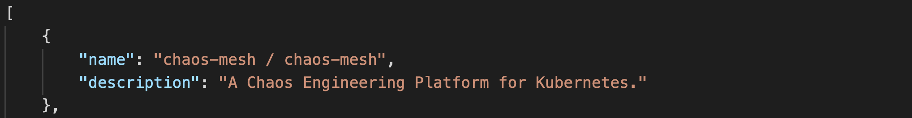

# gohub ☕

[](https://goreportcard.com/report/github.com/squeaky1273/gohub)

_Create your very own web scraper and crawler using Go and [Colly](https://go-colly.org)!_

### 📚 Table of Contents

1. [Project Structure](#project_structure)
2. [Description](#description)
3. [Installation](#installation)
4. [Author(s)](#author(s))
5. [Acknowledgements](#acknowledgements)

## Project Structure

```bash
📂 gohub
├── go.mod
├── go.sum
├── hub.go
├── hub_test.go
├── results.json
└── README.md
```

## Description
📔 Project that jsonifies github related information from projects on the Go Trending page. 📔



- [gohub slides](https://docs.google.com/presentation/d/1jsz-4JATC6XNHIoYHyn1htrsLYymYD1Xc8ptPqY-yp0/edit?usp=sharing)

### Future Features</h3>
- Implement 3rd party API
- Dockerize


## Instructions
#### To get on machine
```git clone https://github.com/squeaky1273/gohub.git```
#### To run code
```go run hub.go```

## Author(s)
Padyn Riddell -<i>initial work</i>- Backend Web Engineer

## Acknowledgements
- God - Thank you for giving the ability to have opportunties to build code and go to school.
- Mom & family - Thank you for beliving in me and being encouraging.